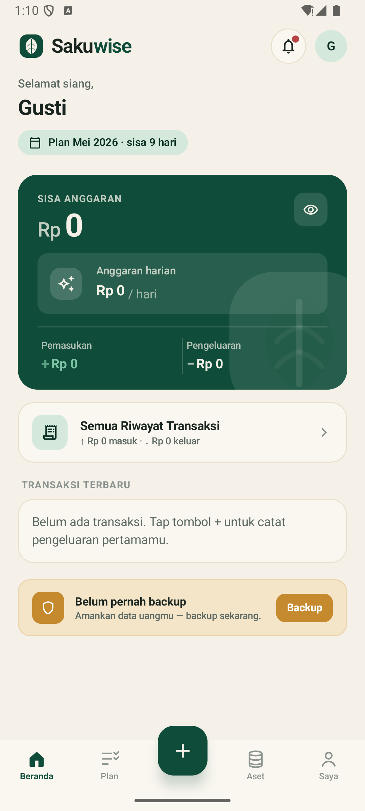
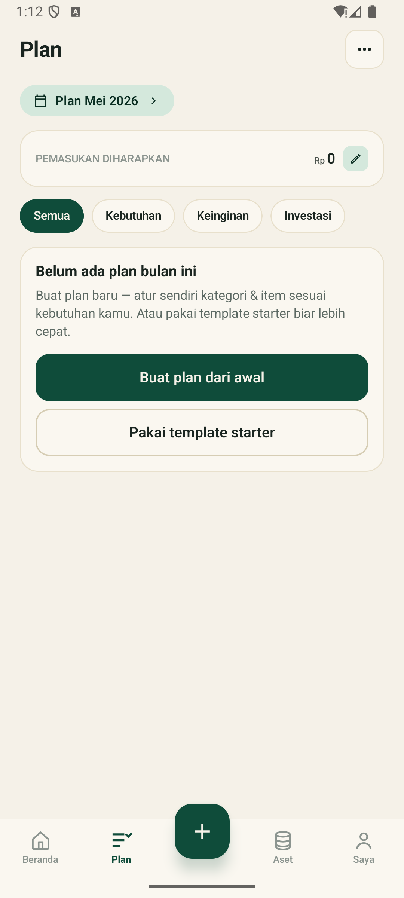
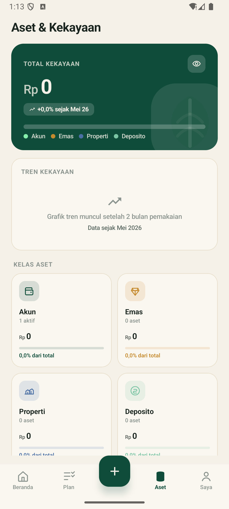
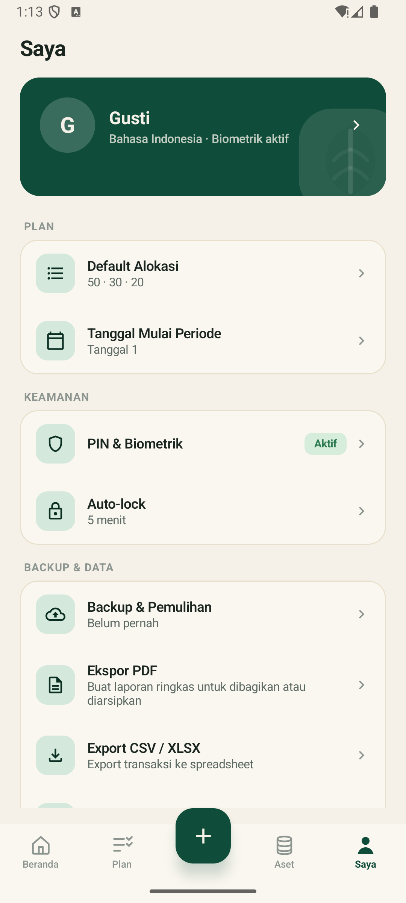
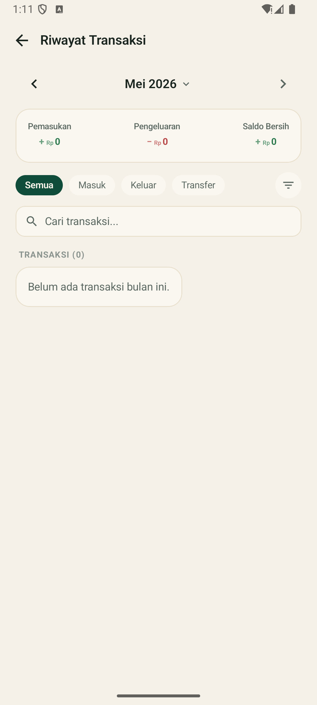
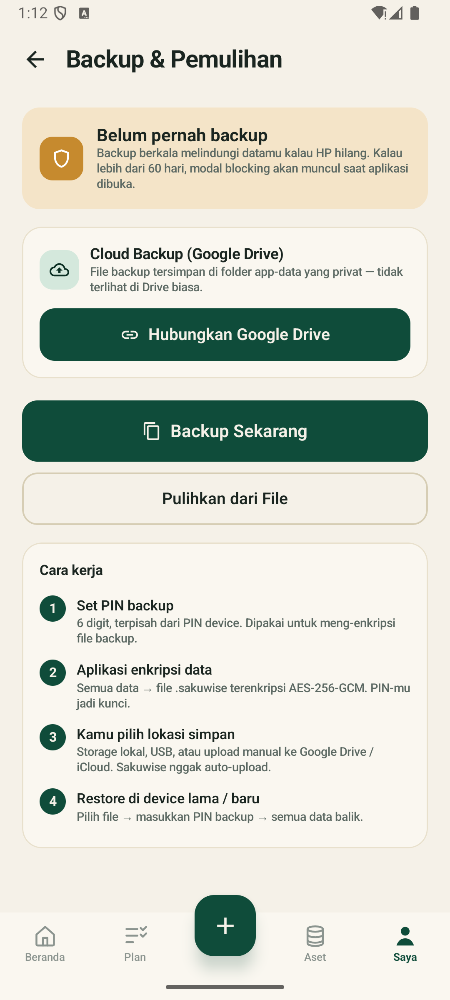

# Sakuwise

> A local-first personal finance Android app built for Indonesian users — replaces the laptop-and-spreadsheet routine with a phone-native budgeting, expense, and net-worth tracker.

[](https://developer.android.com/about/versions/oreo)
[](https://kotlinlang.org/)
[](https://developer.android.com/jetpack/compose)
[](#privacy)

---

## Background

The author maintains a detailed monthly Google Sheet for personal finance — 50/30/20 allocations, per-line Price × Qty budgets, parallel actuals, multiple accounts, gold, land, retirement deposits, and debts all tracked in one workbook. The model works, but spreadsheets are painful to edit on a phone: meaningful updates need a laptop, so daily expense capture slips. The integrated view of investments, properties, and cashflow also doesn't survive the move to mobile.

Sakuwise rebuilds that exact workflow as a phone-native app — same Plan → Track ritual, same allocation buckets, same end-of-month reconciliation — without giving up data ownership.

## Goals

Sakuwise V1 aims to:

1. **Replace the monthly spreadsheet workflow** end-to-end: budget planning with configurable 50/30/20 allocations, daily income & expense capture, multi-account balance tracking, investment tracking (gold, land/property, deposits/pension), debt documentation, and a unified net-worth dashboard.
2. **Cover the Indonesian middle-class money picture** in one place: Rupiah-only, Bahasa Indonesia primary with English secondary, categories that match how people actually spend here (kos, BPJSTK, PBB, THR, mudik, kondangan, etc.).
3. **Guarantee strong privacy**: no internet dependency for core features, encrypted at rest, user-controlled encrypted backups.
4. **Ship a complete V1** that the author can dogfood as the primary user before any wider release.

### Non-goals (V1)

Cloud sync, dead-man's-switch / emergency contact, foreign currencies, income-slip OCR, full loan amortization, multi-user/family sharing, iOS, and any form of telemetry or analytics. All parked in the V2 backlog.

## Privacy

Sakuwise is **local-first** by design:

- The Android manifest does **not** request `INTERNET` permission. No data ever leaves the device automatically.
- The SQLite database is encrypted at rest via **SQLCipher** with a 256-bit AES key wrapped by Android Keystore (hardware-backed where available).
- Backups produce a single `.sakuwise` file: AES-256-GCM ciphertext keyed off a user-set PIN/passphrase via **Argon2id** (~64 MB memory, ~1s on a mid-range Android). The user picks where it goes (local storage, USB, manual upload to a drive of their choice).
- The app collects **zero** personal identifiers — no email, no phone, no NIK. Just a nickname the user picks at onboarding.
- No analytics SDK, no crash reporting SDK, no third-party telemetry.

## Feature Overview

| Module | Highlights |
|---|---|
| **Onboarding** | < 30 second flow: language, nickname + PIN, biometric toggle, privacy notice, first account |
| **Accounts** | Cash / Bank / E-Wallet types, hybrid auto-balance + monthly reconciliation snapshots |
| **Plan & Allocations** | Three-tier tree (Allocation → Category → Plan Item), configurable 50/30/20 split, recurring items auto-roll into the next period |
| **Transactions** | Income / Expense / Transfer with backdating, optional receipt photo (encrypted JPEG BLOB), debt linkage |
| **Dashboard** | Greeting + period · allocation progress · income vs expense · daily-remaining budget · top categories · account balances · net worth · recent transactions · backup banner |
| **Gold** | Per-batch buy date, weight, serial, purchase price; global sell-price input drives live valuation + profit/loss |
| **Property / Land** | Name, location, SHM ID, size, buy date + price, optional current value, PBB tax payment sub-records |
| **Deposits / Pension** | DPLK, BPJSTK JHT, time deposits — monthly balance snapshots with line chart |
| **Debt** | Two-way (I-owe / owed-to-me) with payment history; optional account linkage that creates real cash-flow transactions |
| **OCR Receipts** | On-device ML Kit Text Recognition (no upload) — camera, gallery, or Android share intent → pre-filled expense draft |
| **Backup & Restore** | One encrypted file, restore on a new device with PIN/passphrase; 30-day yellow banner, 60-day blocking modal |
| **Reminders** | WorkManager-scheduled recurring expense reminders (opt-in, requires POST_NOTIFICATIONS) |
| **Settings** | Language, biometric, auto-lock (1/5/15/30 min), period start day (1–28), default allocations, global gold sell price, backup management |

A full feature spec lives in [`design/uploads/Sakuwise PRD v1.3 (ID).md`](design/uploads/Sakuwise%20PRD%20v1.3%20(ID).md).

## Screenshots

<p align="center">
  
  
  
  
</p>

<p align="center">
  
  
</p>

From left to right: **Beranda** (SISA ANGGARAN hero · anggaran harian · Semua Riwayat Transaksi card · transaksi terbaru · backup banner) · **Plan** (period chip · expected-income row · allocation filter chips · empty state with template shortcut) · **Aset** (TOTAL KEKAYAAN hero + trend chart + four asset-class cards: Akun, Emas, Properti, Deposito) · **Saya** (profile card · Plan / Keamanan / Backup & Data settings sections). Below: **Riwayat Transaksi** (month picker · Pemasukan/Pengeluaran/Saldo summary · transaction filter chips · search) · **Backup & Pemulihan** (Cloud Backup/Google Drive section + local backup flow + how-it-works explainer).

Screenshots captured in Bahasa Indonesia locale.

## Technical Architecture

- **Platform:** Android 8.0+ (API 26), single-activity, Kotlin.
- **UI:** Jetpack Compose + Material 3, a small in-house design system (`SwTheme`, `SwType`, `SwButton`, `SwField`, …) tuned to the prototype.
- **Storage:** Room over SQLCipher 4.x — full DB encryption with a Keystore-wrapped DEK. Photos stored as compressed JPEG BLOBs inside the encrypted DB (~200 KB target).
- **DI:** Hilt.
- **OCR:** Android ML Kit Text Recognition v2 (on-device).
- **Background work:** WorkManager for the daily net-worth snapshot and reminder notifications.
- **Crypto:** AES-256 (SQLCipher + GCM for backup), Argon2id for PIN/passphrase-to-key derivation.
- **Localization:** `values/` (id) + `values-en/` (English). Per-app locale via `AppCompatDelegate.setApplicationLocales` (API 33+); a startup reconciler keeps `prefs.language` in sync with whichever side was changed last (in-app picker or system Settings → App info → Language).
- **No analytics, no crash reporting, no internet permission.**

## Default Out-of-the-Box

A fresh install lands the user on a working app with: Bahasa Indonesia, biometric unlock enabled, one "Tunai" account with Rp 0 balance, no plan yet (empty state with a one-tap "Apply Starter Template" banner), no investments, no debts. Greeted by chosen nickname, then the dashboard.

## Building

Requirements:

- Android Studio Hedgehog or newer
- JDK 17
- Android SDK with platform-tools

Then:

```bash
git clone https://github.com/gustiadhitya8/sakuwise-android.git
cd sakuwise-android
./gradlew :app:assembleDebug
./gradlew :app:installDebug   # to install on a connected device/emulator
```

Debug APK lands in `app/build/outputs/apk/debug/`. The debug build's `applicationIdSuffix` is `.debug`, so the package on device is `com.gustiadhitya.sakuwise.debug` and the release build can coexist.

## Project Status

V1 is in dogfooding by the author. Major modules listed above are implemented and exercised on emulator + physical device. Known gaps and the V2 backlog (cloud sync, OCR for income receipts, amortization, iOS port, multi-currency, family sharing) are tracked in the PRD.

## Repository Layout

```
app/
├── src/main/java/com/gustiadhitya/sakuwise/
│   ├── app/                # Application, MainActivity, AppNavGraph, lock controller
│   ├── core/
│   │   ├── common/         # date/rupiah formatters, locale-aware helpers
│   │   ├── crypto/         # PinStore, KeyManager, BackupService
│   │   ├── data/           # repository impls + Mappers
│   │   ├── database/       # Room entities, DAOs, SakuwiseDatabase, migrations
│   │   ├── datastore/      # UserPreferencesRepository (DataStore)
│   │   ├── designsystem/   # SwTheme, SwType, SwButton, SwField, SwCard, …
│   │   ├── domain/         # models + repository interfaces + UseCases
│   │   └── work/           # NetWorthSnapshotWorker
│   └── feature/
│       ├── onboarding/     # 4-step flow + locale picker
│       ├── dashboard/      # main screen
│       ├── plan/           # plan tree CRUD, allocation card, period picker
│       ├── transaction/    # Expense/Income/Transfer forms + OCR
│       ├── asset/          # accounts, gold, land, deposit, debt
│       ├── settings/       # hub + sub-screens (backup, PIN, export, …)
│       └── lock/           # PIN/biometric unlock
└── src/main/res/
    ├── values/             # Bahasa Indonesia strings (default)
    └── values-en/          # English strings
design/                     # PRD, design concept, handoff spec, prototype screens
```

## License & Attribution

Personal project by Gusti Adhitya. Sakuwise is free; an in-app donation link routes to external platforms (Saweria / Trakteer / QRIS) — no payment processing happens inside the app.

The PRD was co-authored with Anthropic's Claude. Application code is co-authored with Claude Code under the author's direction.
